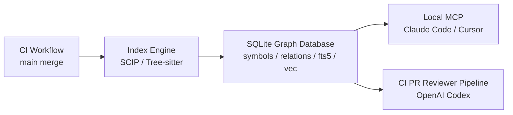

# CodeGraph Engine  
AI 原生代碼情報與極低 Token 消耗基礎設施專為 Claude Code、Cursor 等 AI Agent 與 GitHub Actions CI 設計的雙軌代碼圖譜與審查引擎。透過 SCIP/Tree-sitter 靜態結構圖譜與 SQLite FTS5，達成 Token 費用節省與幻覺減少的 PR 代碼審查與檢索引擎。  
## 核心痛點與解法  
AI Agent 於大型專案開發中的三大痛點  
1.  Context 昂貴且浪費： AI Agent 為了定位一個 Function，常被迫讀取數個極多行的檔案，一口氣吞掉大量的 Tokens。  
2.  Dense Vector 在代碼上的失效： 純文字相似度無法表達強型別語言的語法樹、抽象型別推導與函數呼叫鏈。  
3.  PR Review 盲點： CI 審查時僅看 git diff 視角狹隘，無法得知未修改檔案中，有哪些 Callers 被連帶破壞。  
  
## CodeGraph Engine 的架構解答  
  
本專案採用「CI 負責重型運算產出 Artifact，開發端 (Local MCP) 與 CI 共用」的雙軌模式。  
  

  
### 開發期 Local MCP  
- 消費者：Claude Code、Cursor 等 AI Agent  
- 特點：低延遲、針對單一 Task 的高精度檢索  
- 目標：減少不必要的上下文讀取與 Token 開銷  
  
### 自動化 CI PR Reviewer Pipeline  
- 消費者：OpenAI Codex 等 AI Agent  
- 策略：基於 as_of 虛擬視圖做審查與影響分析  
- 目標：在 PR 中找出被連帶影響的呼叫者與依賴關係  
  
## 工具鏈規格  
codegraph-mcp 透過標準 MCP 提供以下高效率 Tool 呼叫：  
1.  導航類:  
    -   get_file_outline(path):             回傳指定檔案的結構骨架（類別、函數定義、簽名與行號），以約 3% 的 Token 成本取代讀取整個檔案。  
    -   resolve_symbol(query, hint_file?):  使用 SQLite FTS5 對 Symbol 進行全域模糊搜尋與消歧義，回傳不透明控點 Moniker。  
    -   read_symbol_body(moniker):          給定 Moniker 精確讀取該 Function/Class 的實作內容，避免讀入周邊無關代碼。  
    -   get_symbol_definition(moniker):     取得單一 Symbol 的完整型別簽名、定義位置與 Docstring。  
  
2.  圖查詢類:  
    -   get_callers(moniker, depth=1):  回傳全專案所有呼叫此 Symbol 的位置。  
    -   get_implementations(moniker):   解析 Interface $\to$ Concrete Class 的動態分派關係。  
    -   get_type_schema(moniker):       精確拉取 DTO / DB Model / Struct 的欄位型別與約束。
